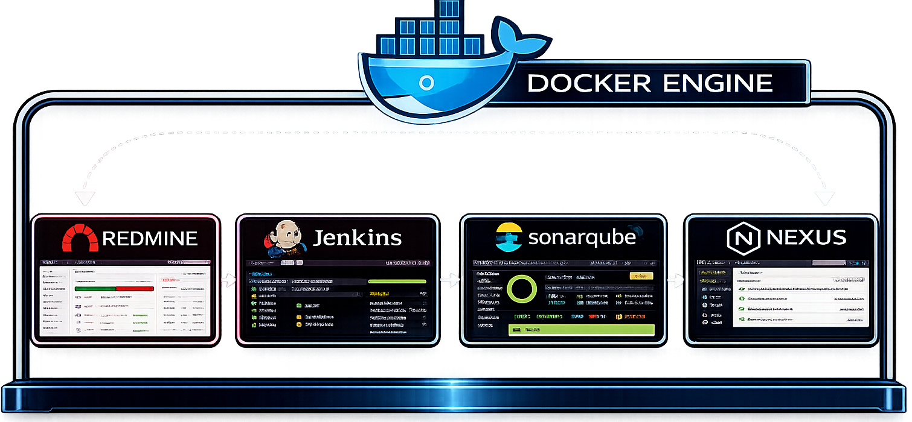
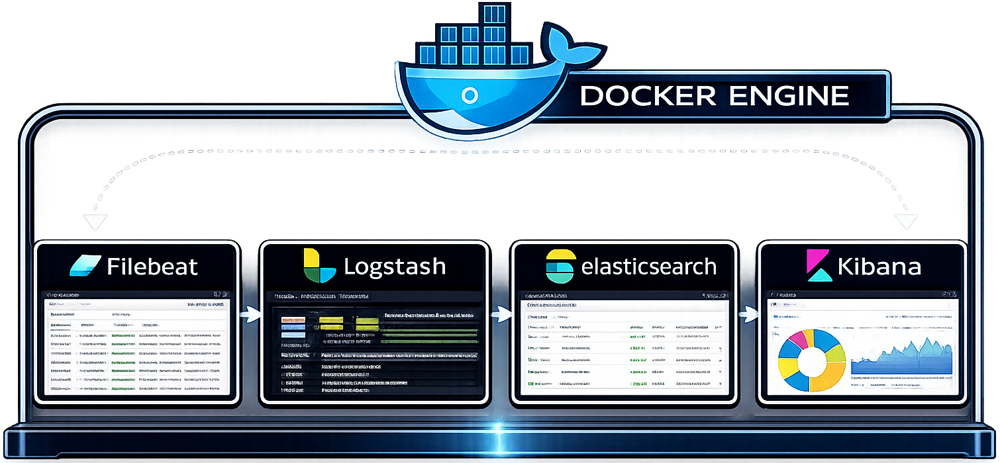
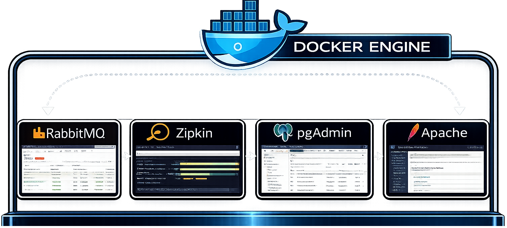
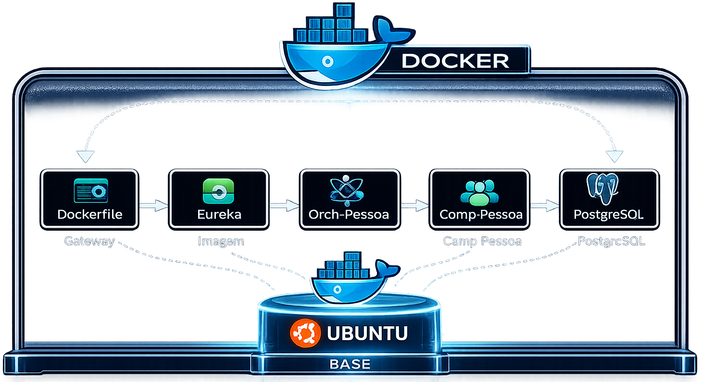

  

# Docker Arquitetural

Ambientes profissionais podem ser construídos utilizando containers para apoiar desenvolvimento, qualidade, observabilidade e operação de sistemas modernos.

Este repositório apresenta uma visão arquitetural sobre como diferentes componentes podem atuar em conjunto para sustentar ecossistemas de software sem exigir grandes investimentos em infraestrutura dedicada.

🌐 <a href="https://programa.systemasweb.com.br">Programa Arquiteto Java Avançado</a>

➡️ <a href="https://github.com/MarceloPF">Github MarceloPF</a>

---

## Por que Docker importa?

A construção de ambientes modernos vai muito além da execução de aplicações.

Ambientes bem estruturados contribuem para:

* Maior autonomia das equipes;
* Redução de custos com infraestrutura;
* Reprodutibilidade entre ambientes;
* Experimentação segura;
* Evolução contínua;
* Padronização operacional.

---

## Ferramentas apoiando o desenvolvimento

  

O desenvolvimento de software envolve muito mais do que escrever código.

Ferramentas especializadas podem apoiar atividades relacionadas à gestão do trabalho, integração contínua, qualidade e distribuição de artefatos, contribuindo para processos mais previsíveis e sustentáveis.

---

## Observabilidade como capacidade arquitetural

  

Sistemas distribuídos geram uma grande quantidade de eventos e informações operacionais.

A centralização e análise desses dados podem ampliar a capacidade das equipes em compreender comportamentos, identificar anomalias e apoiar decisões técnicas mais assertivas.

---

## Serviços que sustentam aplicações modernas

  

Mensageria, rastreamento distribuído, gerenciamento de bancos de dados e servidores web representam exemplos de componentes frequentemente utilizados na construção de ecossistemas corporativos.

A compreensão do papel de cada elemento fortalece a visão sistêmica necessária à atuação arquitetural.

---

## Ecossistemas integrados ampliam possibilidades

  

Containers possibilitam a composição de ambientes complexos a partir de elementos menores e especializados.

A partir de imagens base e estratégias adequadas de organização, diferentes serviços podem coexistir de forma estruturada, favorecendo experimentação, aprendizado e evolução contínua.

---

## O que você encontrará ao longo do Programa?

Ao participar do **Programa Arquiteto Java Avançado**, você terá contato com discussões relacionadas à construção e operação de ambientes arquiteturais inspirados em cenários reais.

O objetivo não está na simples utilização de ferramentas, mas no desenvolvimento da capacidade de compreender:

* Quando utilizá-las;
* Como elas se relacionam;
* Quais problemas ajudam a resolver;
* Quais decisões sustentam ambientes profissionais.

---

## Mais do que containers

Docker representa apenas uma das peças de um ecossistema maior.

A verdadeira evolução acontece quando profissionais passam a enxergar ambientes, ferramentas e processos como partes complementares de uma mesma arquitetura.

É essa visão integrada que permite construir soluções mais sustentáveis ao longo do tempo.

  🐳 <a href="https://hub.docker.com/r/marcelosystemasweb/systemasweb-ubuntu-22.04-jdk17">
    Explore uma das imagens públicas que servem como base para os ambientes apresentados ao longo do Programa
  </a>

---

## Conheça o Programa Arquiteto Java Avançado

🌐 <a href="https://programa.systemasweb.com.br">Programa Arquiteto Java Avançado</a>

  

➡️ <a href="https://github.com/MarceloPF">Github MarceloPF</a>

---

## Sobre o autor

Desenvolvido e mantido por **Marcelo Ferreira**, Arquiteto de Software, fundador da **Systemasweb** e criador do **Programa Arquiteto Java Avançado**.

Com mais de **17 anos de experiência**, atua na construção, evolução e sustentação de sistemas corporativos, compartilhando ao longo desta formação experiências práticas adquiridas em projetos reais.
